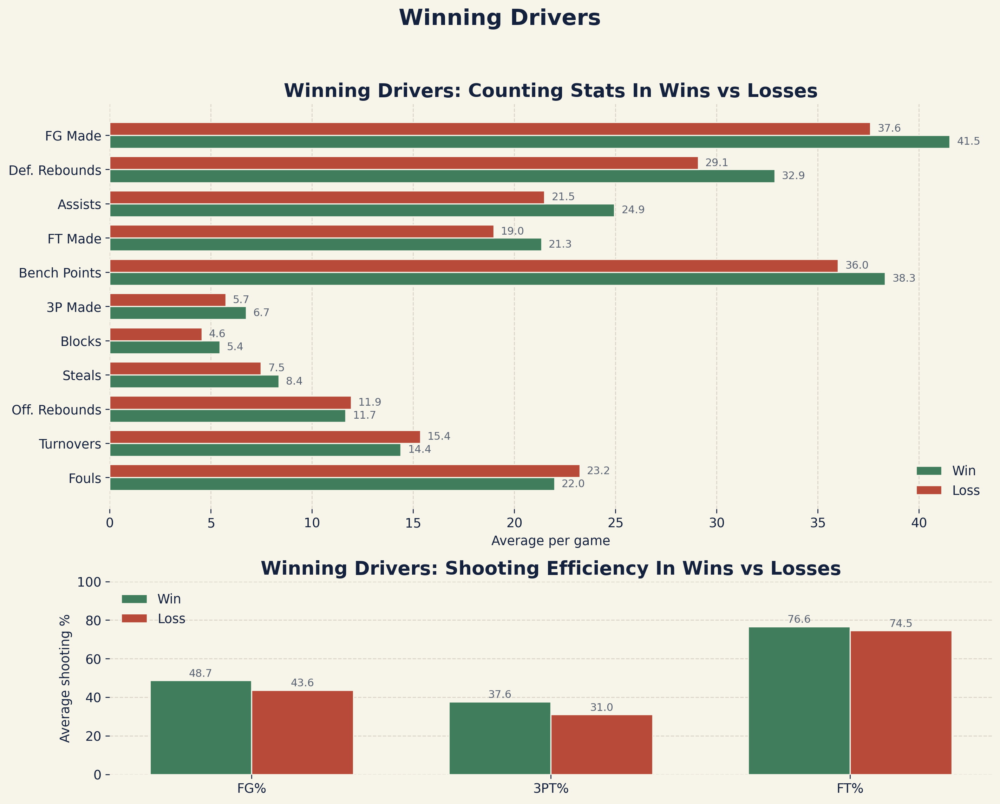
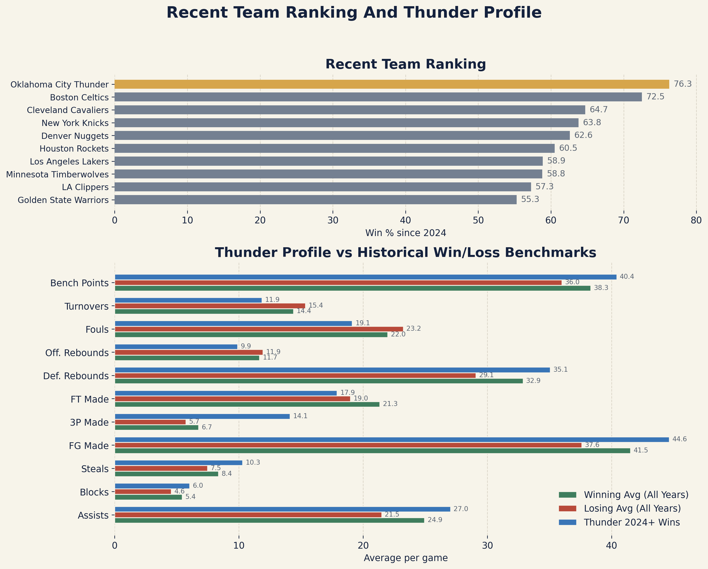
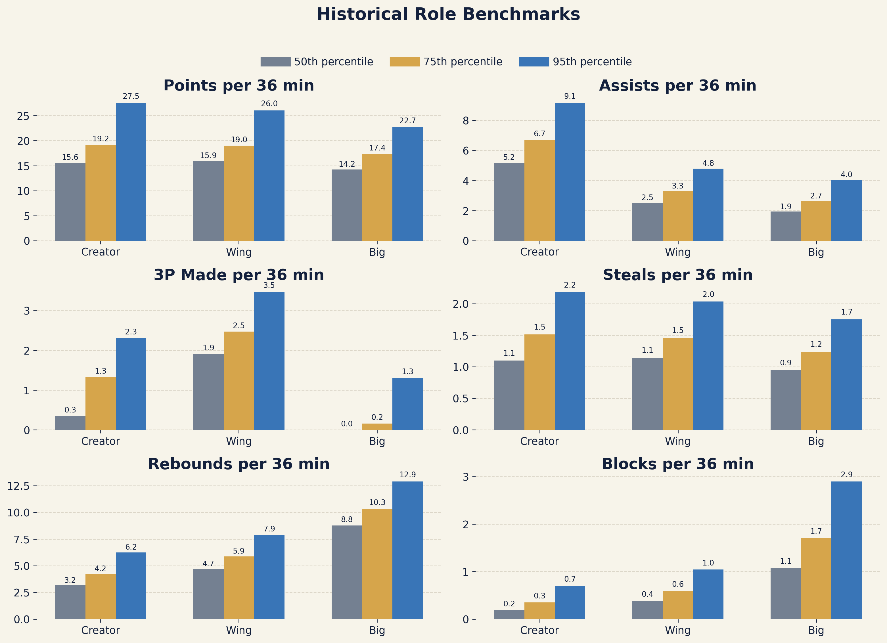
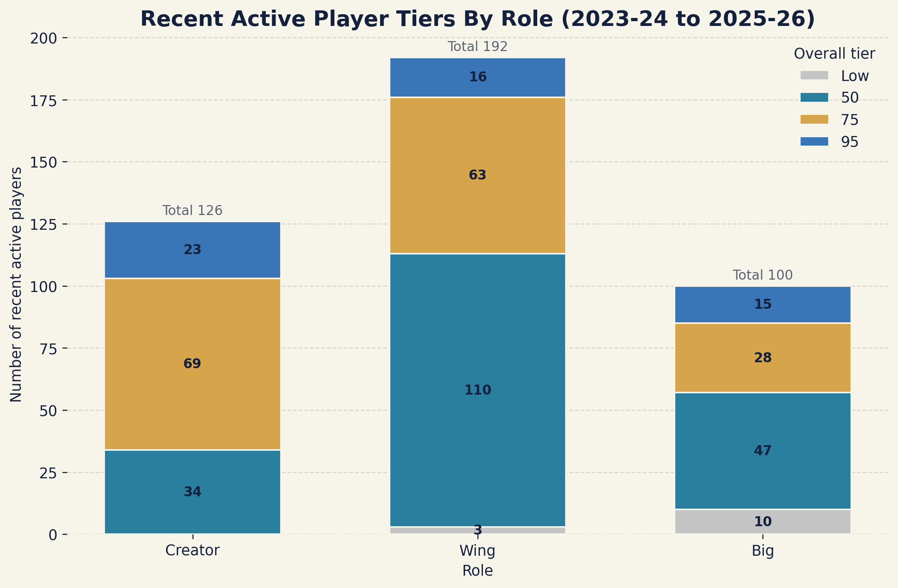

# NBA Analytics

This project builds a local DuckDB warehouse from historical NBA box-score data and uses it to answer four questions:

- What team statistics separate wins from losses?
- How does Thunder's recent profile compare with those league-wide winning patterns?
- What do historical player standards look like for different on-court roles?
- How do current active players compare with those historical standards?

## Data

Source dataset:

- Kaggle: `eoinamoore/historical-nba-data-and-player-box-scores`

The raw CSV files are not stored in the repo. They can be downloaded inside the build notebook with `kagglehub` or placed manually in a local `data/` folder.

## Workflow

The project is notebook-first:

1. [01_build_database.ipynb](notebooks/01_build_database.ipynb) loads the CSV files, cleans key fields, and builds the DuckDB star schema.
2. [02_validation.ipynb](notebooks/02_validation.ipynb) runs sanity checks on the local warehouse.
3. [03_analysis.ipynb](notebooks/03_analysis.ipynb) produces the tables and figures used in the project.

On the current local build, the warehouse contains:

- `1,666,760` rows in `player_stats_fact`
- `146,318` rows in `team_stats_fact`
- `6,691` players
- `51` team dimension rows
- `73,350` games

## Method

- Historical player benchmarks are built at the `player-season` level with at least `750` minutes played and `30` games.
- `Per 36` means a stat is scaled to 36 minutes played. For example, `Points per 36 min` estimates how many points a player would score over 36 minutes of court time.
- Player roles are inferred from box-score production and grouped as `Creator`, `Wing`, or `Big`.
- The benchmark uses `Points`, `Assists`, `3P Made`, `Steals`, `Rebounds`, and `Blocks`, all measured on a per-36-minute basis.
- Tier levels `50`, `75`, and `95` correspond to the 50th, 75th, and 95th percentile benchmark within a role. `Low` means the player stays below the role median.
- The recent active-player pool includes players who appeared during calendar years `2024` or `2025`, using each player's latest qualified season from the last three NBA seasons.

## Visuals

### Winning Drivers



League-wide averages for wins and losses. This chart shows which team box-score areas move most clearly with winning.

### Thunder Profile



Recent team ranking since 2024, followed by a Thunder case study against the historical win and loss averages from the first visual.

### Historical Role Benchmarks



Historical percentile standards for the main player metrics within each inferred role.

### Recent Active Player Tiers



Distribution of the recent active-player pool across the historical role tiers.

## Files

```text
NBA-Analytics/
README.md
requirements.txt
.gitignore
notebooks/
images/
```

## Setup

### 1. Create a Python environment

```bash
python3 -m venv .venv
source .venv/bin/activate
pip install -r requirements.txt
```

### 2. Run the notebooks in order

Open Jupyter Lab or Jupyter Notebook and run:

- [01_build_database.ipynb](notebooks/01_build_database.ipynb)
- [02_validation.ipynb](notebooks/02_validation.ipynb)
- [03_analysis.ipynb](notebooks/03_analysis.ipynb)

In the build notebook:

- set `DOWNLOAD_FROM_KAGGLE = True` if you want the notebook to download the source CSV files
- leave it as `False` if you already placed the CSV files in a local `data/` folder

The build notebook creates `data/nba_analytics.duckdb`. The analysis notebook saves the chart files into `images/`.

## Notes

- The project uses DuckDB only. There is no separate database server setup.
- The local `data/` folder is created during the build step and is ignored by git.
- Team-level results are more stable than any analysis built directly from the raw source position flags.
- The player benchmark is a box-score model. It is not a possession-based impact model.
- Historical team naming variation and some unresolved fact links still remain in the local build.
